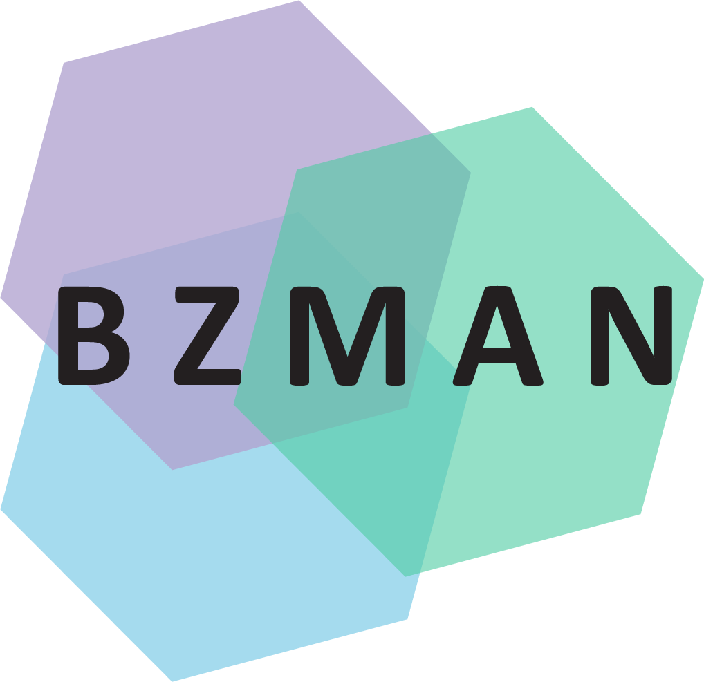
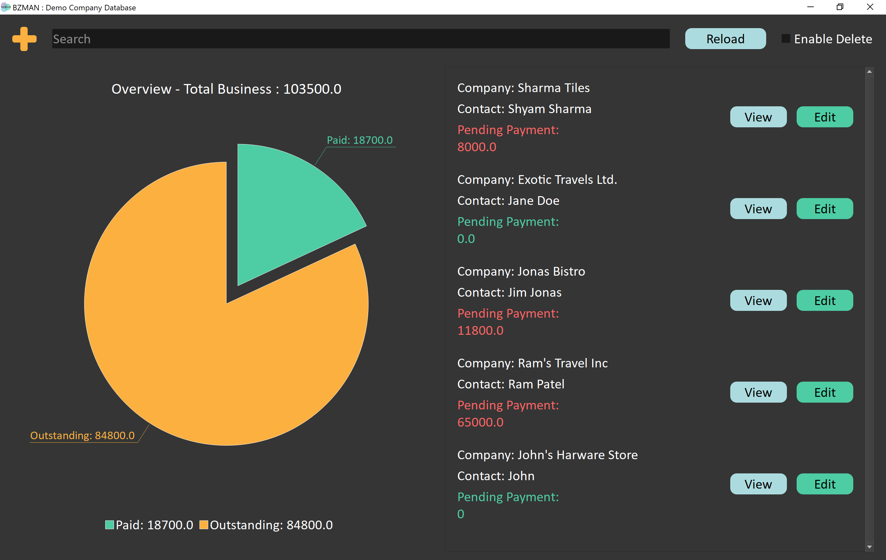
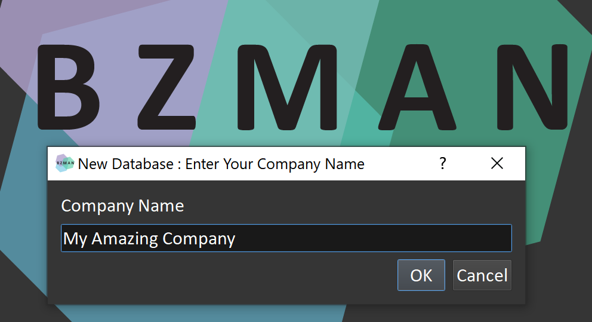
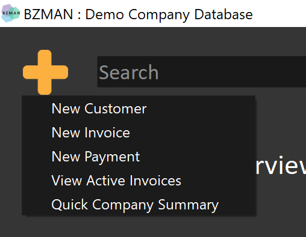
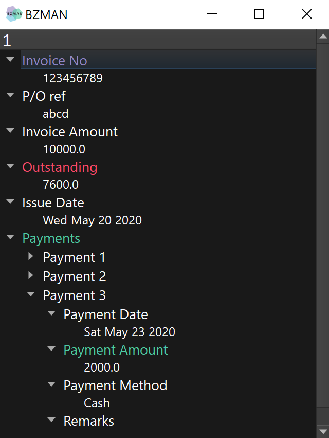
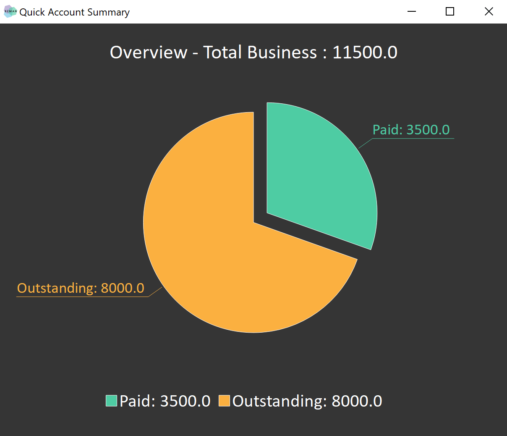

A minimal bussiness management application to simplify daily bussiness activities. It is designed for small bussiness needs.

[Download](https://bzman.herokuapp.com/downloads)

---

---
## Effortlessly Manage Business Activities

Create and manage your company database with a simple and intuitive interface.

## Quick Actions

- Easily add new customers, invoices and payments.
- Look up active invoices and customer summaries.

## Add New Invoices and Payments

Create and manage your customer information, invoices and payments all in one place.

## View and Track Invoices and Payments

Get detailed information on all current and past invoices

## Customer Account Summary

Get customer account summaries at your fingertips.

